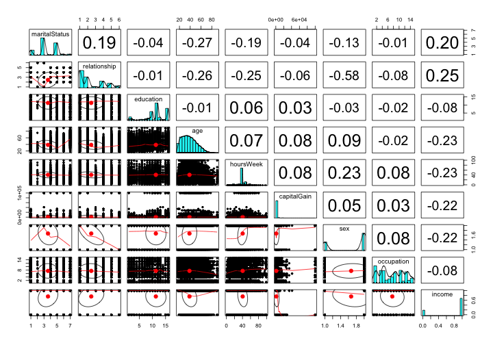

A great way to explore a new data set is to run a pairwise correlation matrix against it. This will pair every combination of your variables and measure the ensuing correlation between them.

To help us understand this process, let's download the [adult.data set](https://archive.ics.uci.edu/ml/datasets/Adult) from the UCI Machine Learning Repository. This data is based on the 1994 Census and attempts to predict those with income exceeding $50K/year:

```r
library(RCurl) # download https data
urlfile <- 'https://archive.ics.uci.edu/ml/machine-learning-databases/adult/adult.data'
x <- getURL(urlfile, ssl.verifypeer = FALSE)
adults <- read.csv(textConnection(x), header=F)

# if the above getURL command fails, try this:
# adults <-read.csv('https://archive.ics.uci.edu/ml/machine-learning-databases/adult/adult.data', header=F)
```
<BR>
We fill in the missing headers for the UCI set and cast the outcome variable 'income' to a binary format of 1 and 0:

```r
names(adults)=c('age','workclass','fnlwgt','education','educationNum',
                'maritalStatus','occupation','relationship','race',
                'sex','capitalGain','capitalLoss','hoursWeek',
                'nativeCountry','income')

adults$income <- ifelse(adults$income==' <=50K',1,0)
```
<BR>
We load the **caret** package to dummify (binarize) all factor variables as the correlation function only accepts numerical values:


```r
dmy <- dummyVars(" ~ .", data = adults)
adultsTrsf <- data.frame(predict(dmy, newdata = adults))
```
<BR>
We borrow two very useful functions from [Stephen Turner](https://gist.github.com/stephenturner/3492773): **cor.prob** and **flattenSquareMatrix**

<BR>
We submit the transformed data set to the **cor.prob** function in order to create a pairwise correlation matrix with P-values and to flatten the result set:

```r
corMasterList <- flattenSquareMatrix (cor.prob(adultsTrsf))
print(head(corMasterList,10))
```

```
##                         i                       j       cor         p
## 1                     age            workclass...  0.042627 1.421e-14
## 2                     age  workclass..Federal.gov  0.051227 0.000e+00
## 3            workclass...  workclass..Federal.gov -0.042606 1.454e-14
## 4                     age    workclass..Local.gov  0.060901 0.000e+00
## 5            workclass...    workclass..Local.gov -0.064070 0.000e+00
## 6  workclass..Federal.gov    workclass..Local.gov -0.045682 2.220e-16
## 7                     age workclass..Never.worked -0.019362 4.759e-04
## 8            workclass... workclass..Never.worked -0.003585 5.178e-01
## 9  workclass..Federal.gov workclass..Never.worked -0.002556 6.447e-01
## 10   workclass..Local.gov workclass..Never.worked -0.003843 4.880e-01
```
<BR>
We create a single vector of variable names (using the original names, not the dummified ones) by filtering those with an absolute correlation of 0.2 against or higher against our outcome variable of 'income':

```r
corList <- corMasterList[order(corMasterList$cor),]
selectedSub <- subset(corList, (abs(cor) > 0.2 & j == 'income'))
bestSub <-  sapply(strsplit(as.character(selectedSub$i),'[.]'), "[", 1)
bestSub <- unique(bestSub)
```
Finally we plot the highly correlated pairs using the **psych** packages **pair.panels** plot (this can be done on the original data as **pair.panels** can handle factor and character variables):
<BR>


```r
pairs.panels(adults[c(bestSub, 'income')])
```

 
<BR>
Full Source:

```r
library(RCurl) # download https data
urlfile <- 'https://archive.ics.uci.edu/ml/machine-learning-databases/adult/adult.data'
x <- getURL(urlfile, ssl.verifypeer = FALSE)
adults <- read.csv(textConnection(x), header=F)

# if the above getURL command fails, try this:
# adults <-read.csv('https://archive.ics.uci.edu/ml/machine-learning-databases/adult/adult.data', header=F)

names(adults)=c('age','workclass','fnlwgt','education','educationNum',
                'maritalStatus','occupation','relationship','race',
                'sex','capitalGain','capitalLoss','hoursWeek',
                'nativeCountry','income')

adults$income <- ifelse(adults$income==' <=50K',1,0)

library(caret)
dmy <- dummyVars(" ~ .", data = adults)
adultsTrsf <- data.frame(predict(dmy, newdata = adults))

## Correlation matrix with p-values. See http://goo.gl/nahmV for documentation of this function
cor.prob <- function (X, dfr = nrow(X) - 2) {
        R <- cor(X, use="pairwise.complete.obs")
        above <- row(R) < col(R)
        r2 <- R[above]^2
        Fstat <- r2 * dfr/(1 - r2)
        R[above] <- 1 - pf(Fstat, 1, dfr)
        R[row(R) == col(R)] <- NA
        R
}
 
## Use this to dump the cor.prob output to a 4 column matrix
## with row/column indices, correlation, and p-value.
## See StackOverflow question: http://goo.gl/fCUcQ
flattenSquareMatrix <- function(m) {
        if( (class(m) != "matrix") | (nrow(m) != ncol(m))) stop("Must be a square matrix.")
        if(!identical(rownames(m), colnames(m))) stop("Row and column names must be equal.")
        ut <- upper.tri(m)
        data.frame(i = rownames(m)[row(m)[ut]],
                   j = rownames(m)[col(m)[ut]],
                   cor=t(m)[ut],
                   p=m[ut])
}

corMasterList <- flattenSquareMatrix (cor.prob(adultsTrsf))
print(head(corMasterList,10))

corList <- corMasterList[order(corMasterList$cor),]
selectedSub <- subset(corList, (abs(cor) > 0.2 & j == 'income'))
bestSub <-  sapply(strsplit(as.character(selectedSub$i),'[.]'), "[", 1)
bestSub <- unique(bestSub)

library(psych)
pairs.panels(adults[c(bestSub, 'income')])
```

